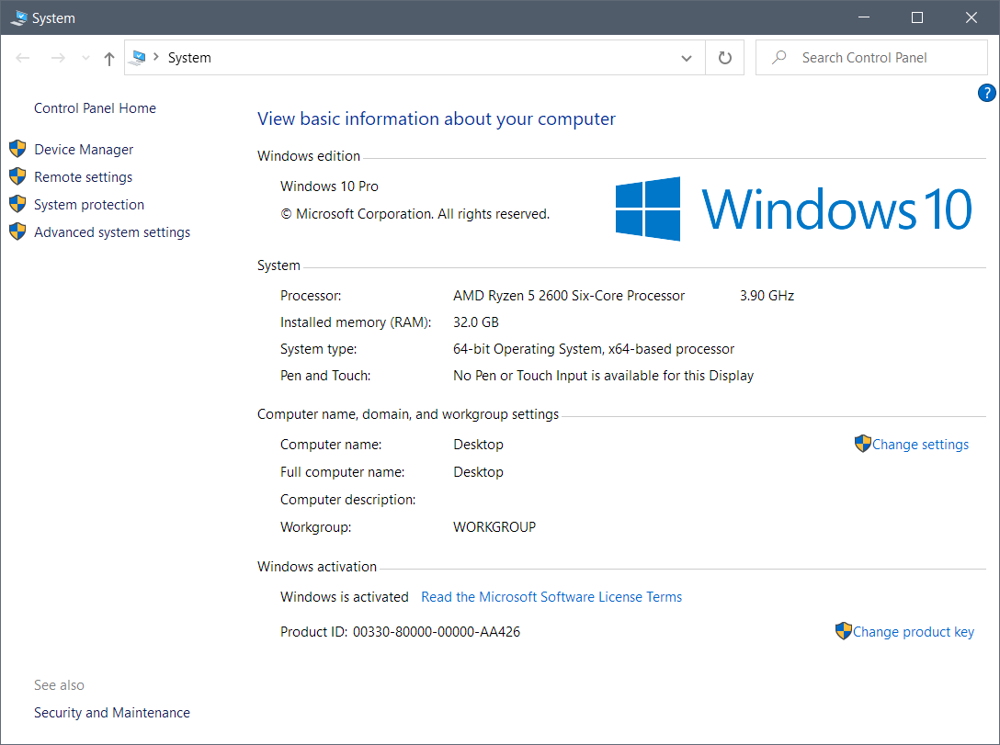
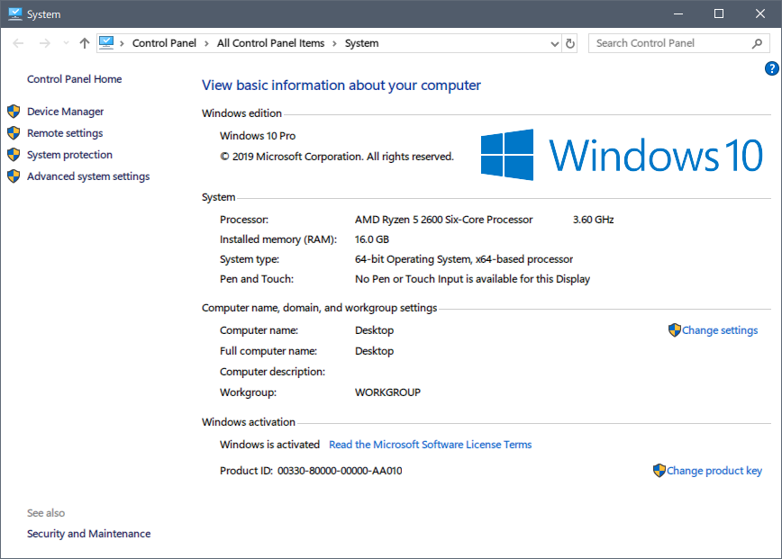
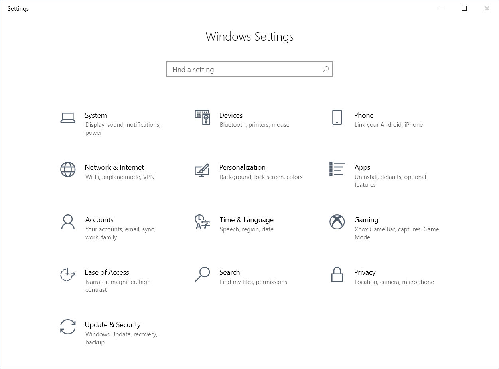
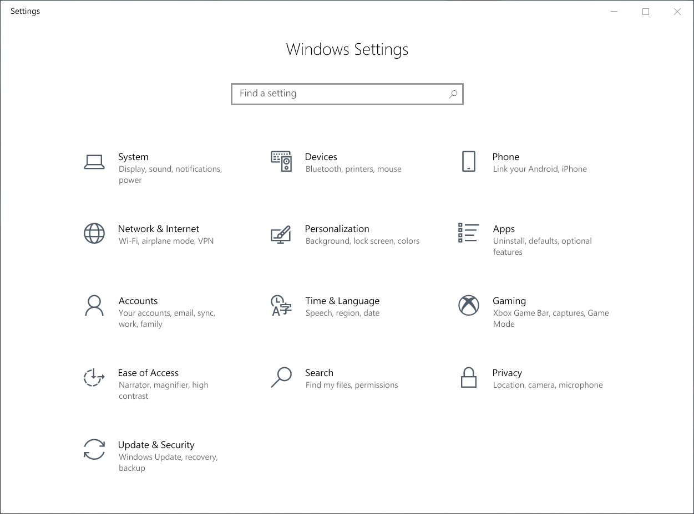

# Chawye Hsu's MacType Profile

[![version][version-svg]][version-link] [![license][license-svg]][license-link]

> A [MacType][mactype-link] Profile designed and maintained by [Chawye Hsu][chawyehsu].

## Usage

This profile was originally designed only for 100% screen scaling, i.e. non-HiDPI.
However, since it's designed for 100% screen scaling, it should work on any higher
DPI. I've used it on a 125% screen scaling nowadays.

To use this profile you'll need to install the `XHei WP` font family from the
`IoF` font set:

> https://bbs.themex.net/showthread.php?t=16898387

If you don't want to install the fonts and don't want to use font substitutions,
then you can turn font substitutions off by setting `FontSubstitutes=0`. You can
still apply the other settings of this profile to the system font.

In theory, the font rendering settings of this profile can be used with any other
typeface. Therefore you can replace those `XHei`s substitutions listed in the
`[FontSubstitutes]` section and `Font` variable in the `[Preview]` section with
the typeface you want to use. (I've tested fonts other than `XHei WP`, see
references below)

To use, simply put `chawyehsu.ini` into MacType's `ini` folder then apply it.

## Screenshots

| Disable | Enable |
|---------|--------|
|  |  |
|  |  |

## History

### early days

Back to 2013 when I was in college, I bought hardwares and assembled my first
PC myself. I decided to adopt the latest version of Windows, which is Windows
8 at that time for the machine, thus I started to look for some contents about
it. I spent lots of time in playing with and learning from the [Windows8吧][windows8-bar],
a reddit-like community. I learnt a lot from the subreddit, including MacType's
information.

Staring from the `Default.ini` profile, I tried and enjoyed lots of different
profiles shared by other MacType users. There was a popular profile set named
`XMac` series used by many users. It's bundled in a font set called [`IoF`][iof-final]
(the full name is *Impression of Font*), made by MaxChow from the [`THEMEX`][themex-link]
forum.

### mid period

Those profiles were well designed and configured for the fonts. I enjoyed it
so much, especially the `XHei` subset. But I was not satisfied with the default
configuration of those `XHei` profiles. I started to make my own MacType profile
with limited knowledge. I chose the `XHei Microsoft` font subset of `IoF` as
the font for font substitutions, because I thought it's similar to the default
OS font. The name of my first MacType profile is `MicrosoftMod.ini`:

```ls
-rw-r--r-- 1 hanabi 197609 9.4K Dec 11  2013 MicrosoftMod.ini
```

It became the only profile I used for the next 3 years. My collage classmate
also used it. My PC's OS was reinstalled to Windows 10 after my graduation at
2016. I installed the new version of MacType and was going to "upgrade" my
profile. I grabbed the final (6th) version of `IoF` and extracted 3 font subset
I preferred, then updated my `MicrosoftMod` profile to 3 different new profiles:

```ls
-rw-r--r-- 1 hanabi 197609 12K May  7  2016 Apple_Mod.ini
-rw-r--r-- 1 hanabi 197609 13K May  7  2016 Microsoft_Mod_Final.ini
-rw-r--r-- 1 hanabi 197609 13K Apr 22  2018 WP_Mod.ini
```

`Microsoft_Mod_Final.ini` is totally based on `MicrosoftMod.ini`, with some
minor rendering tweaks for my new monitor and a change on font substitutions
to fit the fonts from the 6th version of `IoF`. `Apple_Mod.ini` and `WP_Mod.ini`
are then based on `Microsoft_Mod_Final.ini`, using different fonts `XHei Apple`
and `XHei WP` and having compatibility tweaks for ClearType.

### nowadays

After using these new profiles for serveral months, I realized that I prefer
`WP_Mod.ini`. I was stuck in the profile for a long time util open sourcing
this repository and releasing the profile. The profile was renamed to
`chawyehsu.ini` as you can see currently. It has some extras rendering tweaks
compared to the predecessor `WP_Mod.ini`.

### typeface selection

I found the reason why I prefer `XHei Microsoft` and `XHei WP` at my old days
of using MacType, after I learning some knowledge about typeface.

`XHei Microsoft` is a font combined `方正兰亭黑` with `Segoe UI`. `方正兰亭黑`
is a cousin font of `Microsoft Yahei`(`微软雅黑`), they are designed by the
same author, the latin script part of these two fonts are both `Segoe UI`.
That's why it looks similar to the default font of my OS (Windows Chinese
edition).

`XHei WP` is a font combined `Hiragino Sans GB`(`冬青黑体`) with `Segoe WP`.
`Hiragino Sans GB` is included in macOS as a system bundled font since OS X
10.6 Snow Leopard. Although it isn't the default font of the system (Simplified 
Chinese edition), many websites and macOS users perfer it instead of the 
default `华文黑体`. `Hiragino Sans GB` looks better in some aspects. Combining
with `Segoe UI`'s cousin font `Segoe WP`, `XHei WP` gains a Chinese 
script on macOS and a latin script on Windows. And it's tasty for me.

Anything else? Typeface is a interesting field to me. Therefore, I might
try new fonts as time goes on, such as the [HarmonyOS Sans][harmonyos-sans]
font.

## Troubleshooting

**1. Emojis are grayed**

This is a known issue about MacType working with browsers. You may read more about
it in [#3][troubleshooting-1].

**2. CJK characters become white block under Firefox family browsers**

This may occur on Firefox-based browsers resulting complete unavailable to browse
web pages containing CJK characters. There is a [Zhihu][troubleshooting-2] topic
discussing about the same issue. The issue was discovered on Firefox 100 for the
first time, later versions are also affected. A [bug report][troubleshooting-3]
has been submitted to Bugzilla, however it was closed as incompleted due to inactive.

You may try to open `about:config` and set `security.sandbox.content.win32k-disable`
to **`false`** to see if it could mitigate. It is suggested to discuss on the bug
report page, that may help Firefox developers to fix this bug.

## References

- [Chromium based browsers renderer injection issue][reference-1]
- [Titlebar rendering issue][reference-4]
- [Workaround for Chrome 78+][reference-2]
- [Screenshots that using this profile with HarmonyOS Sans][reference-3]

## License

The profile is given to the [Public Domain][license-link].

[version-svg]: https://img.shields.io/badge/Version-3.1.0-blue.svg?style=flat-square
[version-link]: chawyehsu.ini
[license-svg]: https://img.shields.io/github/license/chawyehsu/mactype-profile.svg?style=flat-square
[license-link]: LICENSE
[chawyehsu]: https://github.com/chawyehsu
[mactype-link]: https://github.com/snowie2000/mactype
[baidupan-link]: https://pan.baidu.com/s/1VKBnGvMHSgzofOe_rythuw
[windows8-bar]: https://tieba.baidu.com/f?kw=windows8
[iof-final]: https://bbs.themex.net/showthread.php?t=16898387
[themex-link]: https://bbs.themex.net/forumdisplay.php?f=90
[harmonyos-sans]: https://www.hanyi.com.cn/custom-font-case-7
[troubleshooting-1]: https://github.com/chawyehsu/mactype-profile/issues/3
[troubleshooting-2]: https://www.zhihu.com/question/532158431
[troubleshooting-3]: https://bugzilla.mozilla.org/show_bug.cgi?id=1769811
[reference-1]: https://github.com/snowie2000/mactype/issues/597#issuecomment-564949519
[reference-2]: https://github.com/snowie2000/mactype/wiki/Google-Chrome#workaround-for-chrome-78
[reference-3]: https://github.com/snowie2000/mactype/issues/557#issuecomment-867774860
[reference-4]: https://github.com/snowie2000/mactype/search?q=titlebar&type=issues
